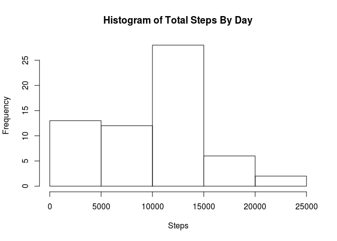
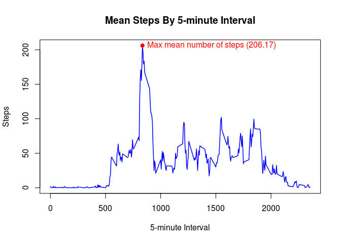
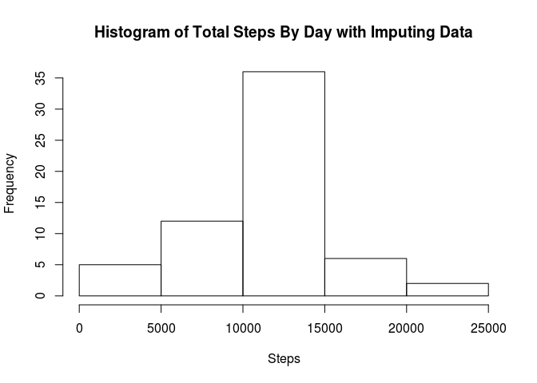
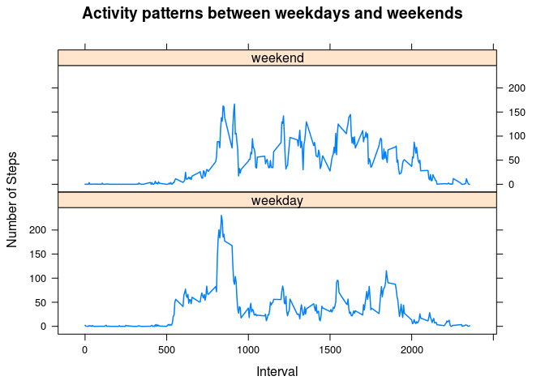

# Reproducible Research: Peer Assessment 1


## Loading and preprocessing the data

```r
data <- read.csv("activity.csv")
data$date <- as.Date(data$date, "%Y-%m-%d")
```


## What is mean total number of steps taken per day?

```r
library(dplyr)
dataGroupedByDay <- group_by(data, date)
totalStepsByDay <- summarize(dataGroupedByDay, stepsByDay =
                             sum(steps, na.rm = TRUE))
title = "Histogram of Total Steps By Day"
hist(totalStepsByDay$stepsByDay, xlab = "Steps", main = title)
```




#### Mean and median of the total number of steps taken per day

```r
mean(totalStepsByDay$stepsByDay)
```

```
## [1] 9354.23
```

```r
median(totalStepsByDay$stepsByDay)
```

```
## [1] 10395
```


## What is the average daily activity pattern?

```r
dataGroupedByInterval <- group_by(data, interval)
meanStepsByInterval <- summarize(dataGroupedByInterval, stepsByInterval =
                                 mean(steps, na.rm = TRUE))
title = "Mean Steps By 5-minute Interval"
plot(meanStepsByInterval$interval, meanStepsByInterval$stepsByInterval,
     type = "l", col = "blue", lwd = 1.5, xlab = "5-minute Interval",
     ylab = "Steps", main = title)

# Plot maximum number of mean steps across all 5-minute intervals
iMax <- which.max(meanStepsByInterval$stepsByInterval)
xMax <- meanStepsByInterval$interval[iMax]
yMax = max(meanStepsByInterval$stepsByInterval)

points(xMax, yMax, col = "red", pch = 19)
text(xMax, yMax, paste0("Max mean number of steps (",
                        format(yMax, digits = 6), ")"),
     pos = 4, col = "red")
```




#### 5-minute interval with max mean number of steps

```r
print(xMax)
```

```
## [1] 835
```


## Imputing missing values

#### Number of missing values in the dataset

```r
sum( ! complete.cases(data))
```

```
## [1] 2304
```

#### Replace missing values with the mean for the 5-minute interval

```r
data <- merge(data, meanStepsByInterval)
data$steps <- ifelse(is.na(data$steps), data$stepsByInterval,
                     data$steps)

# Create a new dataset that is equal to the original dataset but with
# the missing data filled in
data <- select(data, steps, date, interval)

# Make a histogram of the total number of steps taken each day
dataGroupedByDay <- group_by(data, date)
totalStepsByDay <- summarize(dataGroupedByDay, stepsByDay =
                             sum(steps))
title = "Histogram of Total Steps By Day with Imputing Data"
hist(totalStepsByDay$stepsByDay, xlab = "Steps", main = title)
```




#### Mean and median of the total number of steps taken per day with imputing data

```r
mean(totalStepsByDay$stepsByDay)
```

```
## [1] 10766.19
```

```r
median(totalStepsByDay$stepsByDay)
```

```
## [1] 10766.19
```


#### Do these values differ from the estimates from the first part of the assignment?
**Yes, they changed**


#### What is the impact of imputing missing data on the estimates of the total daily number of steps?
**Imputing missing data lowered the histogram tails (values far from the mean) and increased the histogram mean surroundings (values near the mean)**


## Are there differences in activity patterns between weekdays and weekends?

```r
# Save locale in use to establish USA english locale
locale <- Sys.getlocale("LC_ALL")
Sys.setlocale("LC_ALL", "en_US.utf8")
```

```
## [1] "LC_CTYPE=en_US.utf8;LC_NUMERIC=C;LC_TIME=en_US.utf8;LC_COLLATE=en_US.utf8;LC_MONETARY=en_US.utf8;LC_MESSAGES=es_MX.UTF-8;LC_PAPER=es_MX.UTF-8;LC_NAME=C;LC_ADDRESS=C;LC_TELEPHONE=C;LC_MEASUREMENT=es_MX.UTF-8;LC_IDENTIFICATION=C"
```

```r
dayType <- ifelse(weekdays(data$date) %in% c("Saturday", "Sunday"),
                  "weekend", "weekday")
data <- mutate(data, steps, date, interval,
                     dayType = as.factor(dayType))

library(lattice)
dataGroupedByDayTypeAndInterval <- group_by(data, dayType, interval)
meanStepsByDayTypeAndInterval <-
        summarize(dataGroupedByDayTypeAndInterval,
                  stepsByInterval = mean(steps))

title = "Activity patterns between weekdays and weekends"
xyplot(stepsByInterval ~ interval | dayType, lwd = 1.5, 
       data = meanStepsByDayTypeAndInterval, type = "l",
       layout = c(1, 2), xlab = "Interval", ylab = "Number of Steps",
       main = title)
```



```r
# Re-set locale in use
Sys.setlocale("LC_ALL", locale)
```

```
## [1] ""
```
